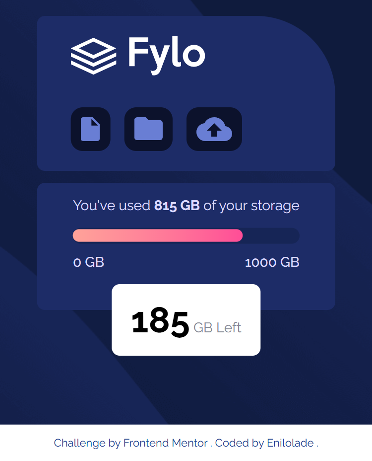

# Frontend Mentor - Fylo data storage component solution

This is a solution to the [Fylo data storage component challenge on Frontend Mentor](https://www.frontendmentor.io/challenges/fylo-data-storage-component-1dZPRbV5n). Frontend Mentor challenges help you improve your coding skills by building realistic projects.

## Table of contents

- [Overview](#overview)

  - [The challenge](#the-challenge)
  - [Screenshot](#screenshot)
  - [Links](#links)

- [My process](#my-process)

  - [Built with](#built-with)
  - [What I learned](#what-i-learned)
  - [Continued development](#continued-development)
  - [Useful resources](#useful-resources)

- [Author](#author)
- [Acknowledgments](#acknowledgments)

## Overview

### The challenge

Users should be able to:

- View the optimal layout for the site depending on their device's screen size

### Screenshot



### Links

- Solution URL: [Github Repo](https://github.com/Enilolade/fylo-data-storage-component)
- Live Site URL: [Github live](https://github.io/Enilolade/fylo-data-storage-component)

## My process

### Built with

- Semantic HTML5 markup
- Tailwind CSS
- CSS custom properties
- Flexbox
- Responsive design with mobile-first workflow

### What I learned

This project helped me solidify my understanding of responsive design with Tailwind, particularly using:

- Responsive background image switching:

  ```html
  class="bg-[url('/images/bg-mobile.png')]
  lg:bg-[url('/images/bg-desktop.png')]"
  ```

- Tailwind’s utility-first approach really improved my speed and consistency.

### Continued development

I want to continue improving my Tailwind skills by exploring more complex layout techniques, animation utilities, and incorporating accessibility best practices (e.g., better ARIA usage for interactive elements).

### Useful resources

- [Tailwind CSS Docs](https://tailwindcss.com/docs) – The official documentation was essential for responsive utilities and layout techniques.
- [Frontend Mentor Discord](https://discord.gg/frontendmentor) – Helpful for quick feedback and tips.

## Author

- Website - [Enilolade](https://github.com/Enilolade)
- Frontend Mentor - [@Enilolade](https://www.frontendmentor.io/profile/Enilolade)
